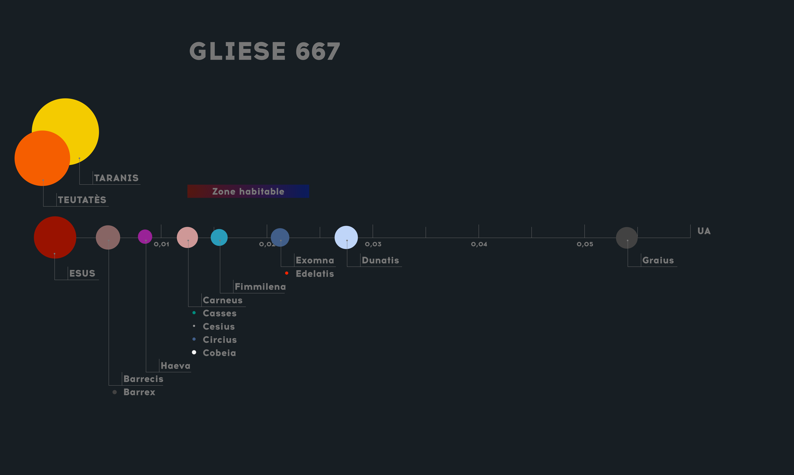

# Aperçu

Système Gliese 667 (142 G., constellation du [Scorpion](http://en.wikipedia.org/wiki/Scorpius)). Tel que connu à ce jour, il comprend 3 étoiles et 7 planètes :

- Gliese 667 A
- Gliese 667 B
- Gliese 667 C
	- Gliese 667 Cb, 
	- Gliese 667 Ch, 
	- Gliese 667 Cc,
	- Gliese 667 Cf,
	- Gliese 667 Ce,
	- Gliese 667 Cd,
	- Gliese 667 Cg,  

*Créer des planètes (pour A et B ?), satellites, ceintures d'astéroides (paramètres d'accrétion ?) plausibles qui deviendront autant de points d'intérêt.
Il faut nommer le système au complet (car Rigel est un système de la constellation d'Orion).*

*Il existe une quatrième étoile à proximité, non liée gravitationnellement au système, qui pourra faire l'objet d'un développement ultérieur.*

## Caractéristiques générales des étoiles A, B, et C

A et B forment un système double autour duquel C orbite. A et B sont très espacées (entre 5 et 20 UA, d'où une orbite très eccentrique). A-B complète une orbite en 42,15 ans. C est encore plus éloignée de A et B (230 UA). A et B apparaitront comme des points faiblement brillants depuis les planètes de C.

## Caractéristiques générales des planètes orbitant Taranis-Teutates

*Le plan orbital du système planétaire est en rotation sur deux axes par rapport à l'axe de rotation de A-B ??? Seulement pour les binaires de type P, pas notre cas.*

*TBD*

Des planètes prospectives autour de A-B seraient :

- Sans possibilité de zone habitable (pour cause de variations thermiques),
- Orbites > 20 UA, probablement eccentriques (?) et instables.
- Longues périodes (longues années)

## Requis

*TBD*

- Jupiter chaude. Implique une seconde gazeuze, car pas d'exploitation à la surface de cette dernière. 
- Une rocheuse massive désertique (~ Mercure)
- Une rocheuse massive (~ Venus)
- Une ceinture d'astéroides
- Une gazeuse (~ Neptune)
- Barren Wasteland (petite rocheuse, lointaine, obscurité quasi-perpétuelle, sans atmosphère...) (~ Pluton)

*"Météo" locale en fonction de la période de l'année (pas d'opérations pendant les extremas chauds. Un extréma chaud dure 1+ ans, an fonction de la période de la planète).
Implique que le minage se fait en campagnes. Même les campagnes planifiées peuvent être perturbées par des éruptions solaires aléatoires.*

## Nomenclature

Propositions choisies parmi les [divinités gauloises](http://www.infobretagne.com/liste-dieux-gaule.htm), avec les divinités majeures pour les étoiles, les divinités mineures pour les planètes :

- A : Taranis / Taran (qui traverse le ciel, tonnerre),
- B : Teutatès ("dieu de la collectivité nationale dans la paix comme dans la guerre" BANDE DE CRYPTO-COMMUNISTES)
	- Berenus, (cf. Belenus) Jupiter chaude,
	- Fortuna, (~ Mercure),
	- Dusii, démons incubes (~ Venus),
	- Crarus, (~ Neptune),
	- Etnosus, (~ Pluton)

# Taranis

Naine orange, 73 % de la masse du soleil, 76 % de son rayon, mais seulement 13 % de la luminosité.

# Teutates

Naine orange, 69 % de la masse du soleil, 5 % de la luminosité.

# Berenus

**Environnement:** Jupiter chaude. Non exploitable, trop chaud. Axe semi-majeur ~20+ UA.

**Géologie:** Géante gazeuse, T° de surface ? Brillance ? Environ 2-3 MJ.

**Atmosphère:** TBD

**Corps en orbite:** Plusieurs lunes rocheuses massives.

**Climat:** TBD

**Populations:** TBD

**Activités:** Stations d'alerte avancées sur les points de Lagrange de l'orbite pour gagner quelques secondes (différence radiation / signal) dans la mise à l'abri des personnels sur les corps plus éloignés.

# Fortuna

#### Environnement
~ Mega-Mercure. Planète la moins massive du système, ~0,8 MT. Axe semi-majeur ~20++ UA.

##### Géologie
Planète rocheuse, très dense. ~1,5g. Volcanisme assez rare mais actif du fait de la proximité des grands corps du système. Reliefs abrupts. Nombreux minéraux radioactifs.

##### Atmosphère
Fine et peu protectrice.

##### Corps en orbite
Aucun ? Trop proche de Berenus.

##### Climat
Températures très élevées à moyennes. Surface pyrolysée par les radiations stellaires.

#### Populations
A déterminer

#### Activités
Planète extrèmement riche en minéraux rares. L'activité économique y est cependant très ralentie par la quasi-absence d'atmosphère (mise en orbite relativement couteuse car sans SSTO atmo), les hautes températures, et la nécessité d'enterrer/de couvrir la plupart des installations.

# Dusii

#### Environnement
~Mega-Venus, masse entre 1,5 et 2 masses terrestres. Axe semi-majeur ~21 UA.

##### Géologie
Planète rocheuse dense. Gravité entre 2 et 3 g. Volcanisme rare. Peu de reliefs du fait de l'érosion rapide. Plateaux/canyons.

##### Atmosphère
Très épaisse, haute pression atmosphérique, tempêtes violentes et fréquentes. Atmosphère corrosive. Des opérations de terraformation de grande échelle pourraient rendre ce monde habitable, mais pas avant plusieurs siècles.

##### Corps en orbite
Astéroides massifs ? Ceinture type Saturne ?

##### Climat
Températures élevées à moyenne. Relativement peu de radiations.

#### Populations
A déterminer

#### Activités
Explotation minière et gazière. Activité scientifique (météorologie notamment). L'atmosphère épaisse permet l'utilisation de SSTO massifs pour la mise en orbite des matériaux exploités. 

# Ceinture d'astéroides ? Nom ? Première lettre ?

#### Environnement
Axe semi-majeur ~23 UA.

##### Géologie
Très variable d'un corps à l'autre, rentabilité variable.

#### Activités
Explotation minière extensive en micro-gravité. Propice aux plus petites companies (pas de mise en orbite nécessaire, système de prospection/concessions). Présence de glace sur quelques corps, source de très hauts revenus.

# Crarus

#### Environnement
~Neptune. ~ 1 MJ. Axe semi-majeur ~25 UA.

##### Géologie
Géante gazeuse, masse entre 0,5 et 1 MJ

##### Atmosphère
A déterminer

##### Corps en orbite
Ceinture type Saturne ? Corps troyens ?

##### Climat
Basses températures.

#### Populations
A déterminer

#### Activités
Tentatives de prospection gazière. Comment ?

# Etnosus

#### Environnement
~Mega-Pluton, ~1 MT. Axe semi-majeur ~30+ UA. Plan orbital incliné. Période relativement rapide ?

##### Géologie
Planète rocheuse dense. Gravité entre 1 et 2 g. Reliefs très escarpés. Présence sporadique d'eau sous forme de glace dans les fonds de vallées.

##### Atmosphère
Fine. 

##### Corps en orbite
Aucun ?

##### Climat
Températures extrèmement basses. Pratiquement aucune luminosité.

#### Populations
Aucune population permanente.

#### Activités
Collecte d'eau. L'éloignement et l'inclinaison de l'orbite font que le voyage est long et couteux en carburant. Les activités sur place doivent être risquées (comment ?). On pourrait imaginer que la collecte d'eau n'est pas économiquement rentable mais que les companies privées se voient imposer cette corvée en échange des droits de prospection, afin d'assurer la survie de tous dans le système.

* * *

### Caractéristiques générales des planètes orbitant ESUS : 

Pour les besoins du BG on fait l'hypothèse que les planètes non-confirmées pour le moment (h et g) existent bel et bien.

Ces planètes sont rocheuses, très massives, très proches les unes des autres et de C (b, h, c, f, e, et d peuvent par exemple être inscrites à l'intérieur de l'orbite de Mercure), avec une période (année) courte, soit entre 7 (b) et 92 (d) jours, soit entre 0,005 et 0,055 UA.

Existe-t-il des planètes gazeuses dans le système ? S'agit-il de géantes gazeuses ? S'agit-il de géantes rocheuses ayant capturé une grande quantité de gaz ?

Toutes les planètes ont une forte inclination par rapport au plan orbital (>30°), ce qui implique des corrections d'inclinaison gourmandes en carburant lors des voyages inter-planétaires.

La masse de chacune de ces planètes implique une gravité très forte. Il faudra donc penser la mise en orbite en conséquence. Une bonne approche serait des avions SSTO pour les corps avec atmosphère, ascenseur spatial dans les autres cas.

Nomenclature - ESUS
----

Propositions choisies parmi les [divinités gauloises](http://encyclopedie.arbre-celtique.com/divinites-gauloises-gallo-romaines-3361.htm), avec les divinités majeures pour les étoiles, les divinités mineures pour les planètes : 

- C : Esus (végétation, richesse),
	- b : Barrex / Barregis / Barrecis ("suprême"),
	- h : Haeva (?),
	- c Overdose de noms cools, au choix : Carneus ("le cornu") / Casses ("dieux du combat", "dieux chevelus", "dieux du bronze") / Cesius ("le javelot") / Circius ("l'impétueux") / Cobeia ("la victorieuse"),
	- f : Fimmilena (culte impérial),
	- e : Exomna ("celle qui est sans peur") / Edelatis (defense du territoire),
	- d : Dunatis ("celui de la forteresse"),
	- g : Graius (?).

Caractéristiques pour chaque corps céleste
----

### C
Naine rouge, 1,4 % de la luminosité du soleil. Cependant, elle apparaitrait 2,3 fois plus plus grande que le Soleil depuis la surface de c, à cause de la distance inférieure.

C brille d'une lumière naturellement rouge. Comment ce rayonnement sera-t-il modifié par les atmosphères des planètes respectives ?

* * * 

### b

#### Environnement
 ~ Mercure. Entre 6 et 12 fois la masse de la Terre (MT). Période de 7 jours seulement. Orbite légèrement elliptique, sans effet.

 Non habitable, trop chaud.

##### Géologie
A déterminer

##### Atmosphère
A déterminer

##### Corps en orbite
Barrex : lune rocheuse 

##### Climat
A déterminer

#### Populations
A déterminer

#### Activités
A déterminer

* * * 

### h

#### Environnement
 ~ Vénus. Entre 1,3 et 2,6 MT. Période de 17 jours seulement. 

 Non habitable, trop chaud.

##### Géologie
A déterminer

##### Atmosphère
A déterminer

##### Corps en orbite
A déterminer

##### Climat
A déterminer

#### Populations
A déterminer

#### Activités
A déterminer

* * * 

### c

#### Environnement
Entre 3,86 et 7,8 MT. Période de 28 jours.

Habitable ?

##### Géologie
A déterminer

##### Atmosphère
A déterminer

##### Corps en orbite

- Casses : lune rocheuse massive, possède une atmosphère, habitable. Effet de serre très important, chaude et humide. Volcanisme actif.
- Cesius : lune rocheuse.
- Circius : lune rocheuse. 
- Cobeia : lune rocheuse.

##### Climat
Limite zone chaude, 23 K plus chaude que la Terre. Luminosité ~ 90 % de la luminosité terreste.

#### Populations
A déterminer

#### Activités
A déterminer

* * * 

### f

#### Environnement
 Entre 2 et 4 MT. Période de 39 jours.

 Habitable ?

##### Géologie
A déterminer

##### Atmosphère
A déterminer

##### Corps en orbite
A déterminer

##### Climat
~ Terre ?

#### Populations
A déterminer

#### Activités
A déterminer

* * * 

### e

#### Environnement
 Entre 2,68 et 5,4 MT. Période de 62 jours.

 Habitable ?

##### Géologie
A déterminer

##### Atmosphère
A déterminer

##### Corps en orbite
Exomna : lune rocheuse, volcanisme très actif (gravitationnellement liée à Edelatis).

##### Climat

Froide ? ~ Terre ?

#### Populations
A déterminer

#### Activités
A déterminer

* * * 

### d

#### Environnement
 Entre 5,21 et 10,4 MT. Période de 92 jours.

Possiblement habitable si l'effet de serre est suffisant

##### Géologie
A déterminer

##### Atmosphère
A déterminer

##### Corps en orbite
A déterminer

#### Climat

Froide ?

#### Populations
A déterminer

#### Activités
A déterminer

* * * 

### g

#### Environnement
 Entre 4,41 et 8,8 MT. Période de 252 jours.

Non habitable, trop froide.

##### Géologie
A déterminer

##### Atmosphère
A déterminer

##### Atmosphère
A déterminer

##### Climat

Froide ?

#### Populations
A déterminer

#### Activités
A déterminer